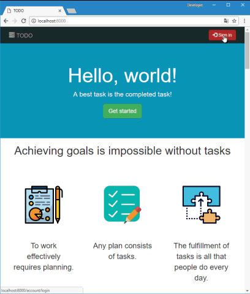

# TODO List

This is a test project that implements a simple TODO list.

[Online demo](http://todo---list.000webhostapp.com).

## Technologies and libraries used

* [PHP MVC Project](https://github.com/php-mvc-project/php-mvc)
* [Doctrine](https://www.doctrine-project.org/)
* [TeaCSS](http://teacss.org/)
* [jQuery](https://jquery.com/)
* [Bootstrap](https://getbootstrap.com/)

## License

This project is licensed under the MIT License - see the [LICENSE](LICENSE) file for details.

Copyright © 2018, [@meet-aleksey](https://github.com/meet-aleksey)